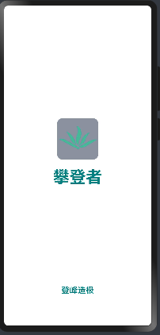
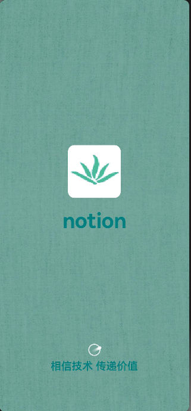

# HormanyOs-notion

#### 🍃介绍🍃
鸿蒙版《概念笔记》 将完成web端notion到hormanyOs的适配

#### ✍软件架构✍
hormanyOs4.0

### 🚀特别提示🚀
1.想找一个类似掘金app端的设计原型图，如果有，加wx: **linhan_0119** 私我

2.欢迎有意者加入开发团队，本人前端，技术热爱狂，希望可以学到更多东西

## ✨star✨
拉取代码，如果觉得写的还可以，希望留下您的star✨✨✨✨

## 现有的一些效果图(作者找虐,每天赶进度!!! 欢迎斧正 🙊)

## 加载页

## 登录页

## 注册页

## tabBar切换
