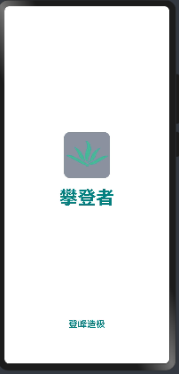

# HormanyOs-notion

#### 🍃介绍🍃
鸿蒙版《概念笔记》 将完成web端notion到hormanyOs的适配

#### ✍软件架构✍
hormanyOs4.0

#### 目录结构
```
├──entry/src/main/ets	                 // 代码区
│  ├──common                             // 公共文件夹
│  │  ├──Constants                       // 公共常量类
│  │  ├──mock                            // 模拟数据
│  │  ├──utils                           // 工具函数
│  │  └──StyleConstants                  // 公共样式常量类
│  ├──CommonComponents                   // 公共组件
│  │  └──BaseComponents.ets              // 全局基础组件
│  ├──entryability
│  │  └──EntryAbility.ets	            // 程序入口类
│  ├──features                          // 功能组件文件夹 以tabBar页面分类
│  │  └──home	                        // 以tabBar页面分类
│  ├──pages                             // tabBar主入口页面
│  │  ├──article.ets                    // 文章
│  │  ├──auth.ets                       // 登录注册
│  │  ├──community.ets                  // 社交
│  │  ├──home.ets                       // 应用首页
│  │  └──mina.ets                       // 我的
│  └──view                              // 主程序入口文件包含tabBar,启动页
│  │  ├──MainPage.ets                   // tabBar
│  │  ├──SplashPage.ets                 // 启动页
└──entry/src/main/resources	         // 资源文件目录
```
### 🚀参与贡献🚀
1. Fork 本仓库

2. 欢迎有意者加入开发团队，本人前端，技术热爱狂，希望可以学到更多东西


### 🚀特别提示🚀
1.想找一个类似掘金app端的设计原型图，如果有，私我

2.**本人微信：linhan_0119**

3.再次欢迎各位大佬斧正


## ✨star✨
拉取代码，如果觉得写的还可以，希望留下您的star✨✨✨✨

## 现有的一些效果图(作者找虐,每天赶进度!!! 欢迎斧正 🙊)

## 加载页


## 登录页


## 注册页


## tabBar切换
