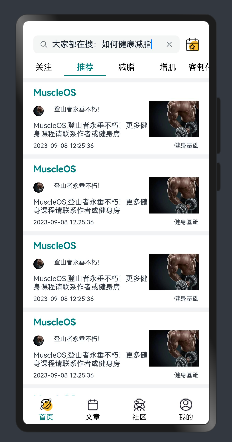

# MuscleOS攀登者

# 🍃介绍🍃
鸿蒙版健身平台，可以交流健身心得，提供健身课程，指定健身计划等

#### ✍软件架构✍
hormanyOS4.0

#### 目录结构
```
├──entry/src/main/ets	                 // 代码区
│  ├──common                             // 公共文件夹
│  │  ├──Constants                       // 公共常量类
│  │  ├──mock                            // 模拟数据
│  │  ├──utils                           // 工具函数
│  │  └──StyleConstants                  // 公共样式常量类
│  ├──CommonComponents                   // 公共组件
│  │  └──BaseComponents             // 全局基础组件
│  ├──entryability
│  │  └──EntryAbility.ets	            // 程序入口类
│  ├──features                          // 功能组件文件夹 以tabBar页面分类
│  │  └──home	                        // 以tabBar页面分类
│  ├──pages                             // tabBar主入口页面
│  │  ├──article.ets                    // 文章
│  │  ├──auth.ets                       // 登录注册
│  │  ├──community.ets                  // 社交
│  │  ├──home.ets                       // 应用首页
│  │  └──mina.ets                       // 我的
│  └──view                              // 主程序入口文件包含tabBar,启动页
│  │  ├──MainPage.ets                   // tabBar
│  │  ├──SplashPage.ets                 // 启动页
└──entry/src/main/resources	         // 资源文件目录
```

## 加载页


## 登录页


## 注册页


## tabBar切换


## 页面显示内容
